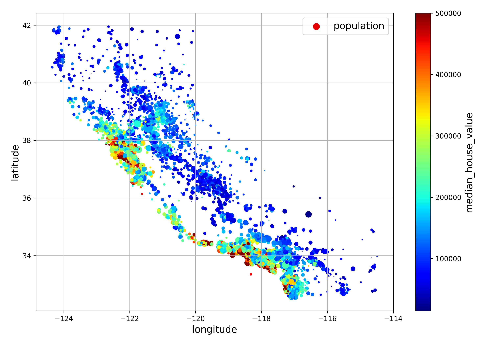

# Boston Housing Dataset Regression Project

## Project Overview

This project aims to predict housing prices in Boston based on various features of the houses and their surrounding areas. The project involves data exploration, pre-processing, model building, and evaluation using different regression techniques. The visualizations play a crucial role in understanding the data distribution, the relationships between variables, and the performance of the models.

## Dataset

The Boston Housing Dataset contains information about various attributes of Boston houses, including the number of rooms, the age of the house, the distance to employment centers, and more. The target variable is the median value of owner-occupied homes.

## Project Structure

The project is structured into several key sections:

1. **Data Exploration**:
   - This section involves the initial analysis of the dataset to understand the distributions of different features and identify any potential outliers or anomalies.
   - Key visualizations include histograms, scatter plots, and correlation matrices.

   

2. **Data Pre-processing**:
   - Before feeding the data into the model, several pre-processing steps are performed, including handling missing values, scaling features, and encoding categorical variables.
   - The dataset is split into training and testing sets to evaluate the performance of the model.

3. **Data Visualization**

Visualizations play a pivotal role in this project, offering deep insights into the relationships between various features and the target variable. Through a series of detailed plots, we explore and unravel key patterns and trends within the dataset:

- **Exploratory Data Analysis (EDA):** Initial visualizations depict the distribution of individual features, helping to identify any potential outliers, skewed distributions, and correlations among variables.

- **Feature Relationships:** Scatter plots are used to explore the relationships between key features and the target variable, revealing how different factors might influence housing prices.

- **Clustering Analysis:** By grouping similar districts, we gain a more granular understanding of different housing market segments, providing actionable insights that can improve model performance.

- **Distribution Visualization:** We can also show the distribution of housing prices across different regions.

These visualizations are not just a supplement to the analysis but are integral to understanding the underlying data, guiding the development and refinement of the predictive models.

4. **Model Building**:
   - Several regression models are built and evaluated, including Linear Regression, Ridge Regression, and Lasso Regression.
   - Hyperparameter tuning is performed to optimize the models and improve their predictive performance.

5. **Model Evaluation**:
   - The models are evaluated using metrics such as Mean Squared Error (MSE), Root Mean Squared Error (RMSE), and R-squared to measure their accuracy and generalization capability.
   - Visualization of model predictions against actual values is used to assess the model's performance.

6. **Conclusion**:
   - The best-performing model is selected based on the evaluation metrics.
   - Insights are drawn regarding the most significant features impacting housing prices and how well the model can generalize to unseen data.

## Results

- The Linear Regression model showed good performance but was slightly outperformed by Ridge Regression after hyperparameter tuning.
- Visual analysis using scatter plots and clustering helped in identifying key factors influencing housing prices, leading to better model understanding and improved predictions.

## How to Use

1. **Clone the repository**:
   bash
   git clone https://github.com/your_username/boston_housing_regression.git
   

2. **Navigate to the project directory**:
   bash
   cd boston_housing_regression
   

3. **Run the Jupyter Notebook**:
   bash
   jupyter notebook boston_housing_regression.ipynb
   

4. **Explore the Visualizations**:
   - Check the images directory to view the visualizations separately or in the context of the notebook.

## Inspiration
This project draws heavily from the foundational concepts and methodologies presented in Hands-On Machine Learning with Scikit-Learn and TensorFlow by Aurélien Géron. The book, published by O'Reilly Media in 2017, serves as a comprehensive guide for building intelligent systems, making it an invaluable resource for anyone interested in machine learning and data science.

## Reference:
Aurélien Géron, Hands-On Machine Learning with Scikit-Learn and TensorFlow: Concepts, Tools, and Techniques to Build Intelligent Systems, 1st edition, O'Reilly Media, 2017, ISBN: 1491962291.
